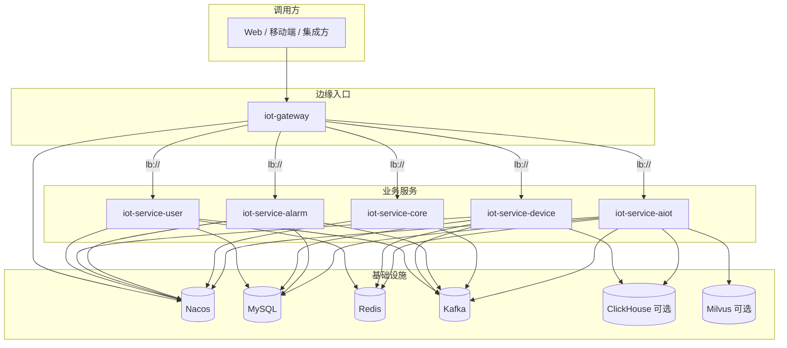

# IoT Platform

基于 **Spring Boot 2.7**、**Spring Cloud 2021** 与 **Spring Cloud Alibaba** 的 IoT 业务微服务单体仓库（Maven 多模块）。对外通过 **API 网关**统一入口，服务注册与配置依赖外部 **Nacos**；业务数据主要使用 **MySQL**，并结合 **Redis**、**Kafka**、**ClickHouse**（按需）等中间件。

---

## 目录

- [功能概览](#功能概览)
- [技术栈](#技术栈)
- [模块与架构](#模块与架构)
- [网关路由与安全](#网关路由与安全)
- [环境准备](#环境准备)
- [本地开发与运行](#本地开发与运行)
- [Nacos 配置说明](#nacos-配置说明)
- [容器镜像与 CI](#容器镜像与-ci)
- [可选组件](#可选组件)
- [文档与约定](#文档与约定)

---

## 功能概览

| 模块 | 说明 |
|------|------|
| **iot-gateway** | 统一 API 入口、动态路由（`lb://` + Nacos 服务发现）、全局过滤器（请求 ID、访问日志、可选 JWT 与下游信任头）、CORS |
| **iot-service-user** | 多租户 / 门店模型；登录与 JWT；用户、角色、权限、租户、门店等管理接口 |
| **iot-service-device** | 设备类型、设备、点位等设备主数据 CRUD；设备元数据缓存（Redis）；可选 ClickHouse 探测 |
| **iot-service-alarm** | 告警规则管理；告警记录查询 |
| **iot-service-core** | 跨服务编排示例：通过 Feign 聚合用户 / 角色 / 设备 / 告警等只读视图；示例 XXL-Job 任务 |
| **iot-service-aiot** | AI 与数据能力：自然语言查数（NL2SQL 管线）、知识库 ingest/QA（可选 Milvus）、AI 报表与能耗预测接口占位、报表下载等 |
| **中间件 Starter** | 统一封装 Redis、Kafka、ClickHouse、XXL-Job 等依赖与开关，减少各服务重复配置 |
| **iot-platform-common** | 统一响应 `ApiResult`、错误码、JWT 工具与网关透传头等公共能力 |

更细的职责边界见 [`docs/MODULES.md`](docs/MODULES.md)。

---

## 技术栈

| 类别 | 选型 |
|------|------|
| 语言与构建 | Java 8、Maven |
| 应用框架 | Spring Boot 2.7.18 |
| 微服务 | Spring Cloud 2021.0.9、Spring Cloud Alibaba 2021.0.6.2 |
| 网关 | Spring Cloud Gateway |
| 注册 / 配置 | Nacos（Discovery + Config） |
| 持久化 | Spring Data JPA、MySQL 8 驱动 |
| 缓存 / 消息 | Spring Data Redis、Spring Kafka |
| 分析引擎 | ClickHouse JDBC（HTTP）、可选向量库 Milvus（AIoT 知识库） |
| 任务调度 | XXL-JOB 2.4.0 |
| API 文档 | OpenAPI 3（Swagger 注解） |
| 安全 | JWT（jjwt）、网关与下游服务之间的共享密钥信任（`GatewayTrust`） |

---

## 模块与架构



**Maven 子模块一览**（根 `pom.xml`）：

- `iot-platform-common` — 公共库  
- `iot-platform-starter-redis` / `kafka` / `clickhouse` / `xxljob` — 中间件自动配置  
- `iot-gateway` — 网关  
- `iot-service-user` / `device` / `alarm` / `core` / `aiot` — 业务服务  
- `xxl-job-admin` — 调度中心部署辅助（含示例 `docker-compose`）

---

## 网关路由与安全

路由由 **Nacos 中网关的配置**驱动（模板见 `nacos-config/iot-gateway.yml`），典型前缀如下（经 `RewritePath` 转发到各服务内部的 `/api/v1/...`）：

| 网关路径前缀 | 目标服务 | 示例（经网关的完整路径） |
|--------------|----------|-------------------------|
| `/api/v1/user/**` | `iot-service-user` | 例：`/api/v1/user/auth/login` → 服务内 `/api/v1/auth/login` |
| `/api/v1/device/**` | `iot-service-device` | 例：`/api/v1/device/devices` → 服务内 `/api/v1/devices` |
| `/api/v1/alarm/**` | `iot-service-alarm` | 例：`/api/v1/alarm/rules`、`/api/v1/alarm/records` |
| `/api/v1/core/**` | `iot-service-core` | 例：`/api/v1/core/integration/users` → `/api/v1/integration/users` |
| `/api/v1/aiot/**` | `iot-service-aiot` | 例：`/api/v1/aiot/chat`、`/api/v1/aiot/kb/qa` |

**安全要点**（具体开关与密钥均在 Nacos / 环境变量中配置，勿提交真实生产密钥到仓库）：

- **JWT**：网关可对 Bearer Token 做校验；用户服务签发 Token，声明中含租户、门店等上下文。  
- **下游信任**：服务可启用 `iot.gateway-trust`，校验网关注入的共享密钥头，仅信任来自网关的请求。  
- **放行路径**：登录等接口在网关 `permit-paths` 中放行（与 `iot-gateway.yml` 保持一致）。

---

## 环境准备

在启动任意业务服务前，建议准备好：

1. **JDK 8**、**Maven 3.6+**  
2. **Nacos**（服务发现 + 配置中心；版本需与 Spring Cloud Alibaba 兼容）  
3. **MySQL 8**：为各服务创建独立库（如 `iot_user`、`iot_device`、`iot_alarm`、`iot_core`、`iot_aiot` 等，名称与你们 `bootstrap` / Nacos 中 JDBC URL 一致）  
4. **Redis**  
5. **Kafka**（若关闭 `iot.middleware.kafka.enabled` 可暂不启用，需与依赖一致）  
6. （可选）**ClickHouse**：设备服务探测、AIoT 自然语言查数等  
7. （可选）**Milvus**：AIoT 知识库向量检索；K8s 部署可参考 `deploy/k8s/milvus/` 下 Helm 脚本与 `values` 示例  

各服务的 **端口、数据源、Redis、Kafka、LLM Key** 等均以 **Nacos 配置**为准；仓库内 `nacos-config/*.yml` 仅为**模板**，导入后请按环境修改为占位符或密钥管理系统注入的值。

---

## 本地开发与运行

### 1. 编译全仓库

```bash
mvn -DskipTests clean package
```

### 2. Spring Profile 与 Nacos

各服务使用 `bootstrap.yml` + `bootstrap-{profile}.yml` 连接 Nacos。开发环境通常使用 **`dev`** profile（示例见各模块 `src/main/resources/bootstrap-dev.yml`），其中包含：

- `spring.cloud.nacos.discovery.server-addr`、`config.server-addr`  
- `namespace`、`group`（如 `iot-group`）  
- 用户名密码（建议本地改为环境变量或私密配置）

启动时加参数，例如：

```bash
# 示例：启动用户服务（请先确保 Nacos 中已有对应 dataId 配置）
cd iot-service-user
mvn spring-boot:run -Dspring-boot.run.profiles=dev
```

网关、各业务服务**启动顺序**：先 **Nacos** 与 **MySQL/Redis/Kafka** → 再启动各 **微服务** → 最后启动 **网关**（或按需并行，只要依赖就绪）。

### 3. 单独运行某个模块 JAR

```bash
java -jar iot-gateway/target/iot-gateway-*.jar --spring.profiles.active=dev
```

Dockerfile 位于各带容器构建的模块根目录（如 `iot-gateway/Dockerfile`），默认基于 `eclipse-temurin:8-jre`，打包产物为 `target/*.jar`。

---

## Nacos 配置说明

1. 在 Nacos 控制台创建与各服务 `spring.application.name` 对应的配置，**dataId** 建议与仓库 `nacos-config/` 下文件名一致（如 `iot-gateway.yml`、`iot-service-user.yml`），**group** 与 `bootstrap-dev.yml` 中一致（示例为 `iot-group`）。  
2. 将 `nacos-config/` 中 YAML **内容导入**或复制到控制台；**生产环境**可使用 `nacos-config/prod/` 下模板做差异化。  
3. **务必替换**：数据库密码、Redis 密码、JWT secret、网关下游密钥、第三方 LLM API Key、内网地址等。  
4. 网关监听端口以 Nacos 中 `server.port` 为准（模板中为 `8180`，与 Dockerfile `EXPOSE` 可能不同，容器运行时请映射实际端口）。

---

## 容器镜像与 CI

### 本地构建镜像（示例）

在各模块已 `mvn package` 的前提下：

```bash
docker build -t your-registry/iot-gateway:1.0.0 ./iot-gateway
```

其他带 `Dockerfile` 的服务模块同理（如 `iot-service-user`、`iot-service-device` 等）。

### Jenkins

根目录 [`Jenkinsfile`](Jenkinsfile) 提供示例流水线：

- **Checkout**：从指定 Git 地址拉取 `main`  
- **Build JARs**：`mvn -DskipTests clean package`  
- **Build & Push Images**：对 `iot-gateway`、`iot-service-user`、`iot-service-device`、`iot-service-alarm`、`iot-service-core` 循环 `docker build` / `push` 到 Harbor  

若需将 **iot-service-aiot** 一并纳入镜像流水线，在 `Jenkinsfile` 的 `for m in ...` 列表中追加模块名，并确保该模块目录下 Dockerfile 与 JAR 产物路径正确。

部署到 Kubernetes 等编排系统的清单**不在本仓库维护**（历史说明见 [`docs/DEPLOYMENT.md`](docs/DEPLOYMENT.md)），可按组织规范自行编写 Deployment/Ingress 并挂载配置中心。

---

## 可选组件

### XXL-JOB 调度中心

`xxl-job-admin/docker-compose.yml` 提供调度中心容器示例，数据库指向**外部 MySQL**（需预先初始化 XXL-JOB 表结构）。各业务服务通过 `iot.xxl.job.*` 开关执行器并向 Admin 注册。

### Milvus（向量检索）

`deploy/k8s/milvus/` 下提供 Helm 安装脚本与 `values-standalone.yaml` / `values-cluster.yaml`，供 AIoT 知识库等场景选用。

---

## 文档与约定

| 文档 | 内容 |
|------|------|
| [`docs/MODULES.md`](docs/MODULES.md) | 各 Maven 模块职责与扩展建议 |
| [`docs/DEPLOYMENT.md`](docs/DEPLOYMENT.md) | 部署相关说明与注意事项 |

**版本与分支**：当前父 POM 版本为 `1.0.0-SNAPSHOT`；生产发布建议改为固定版本号并打 Tag。

---

## 开源与许可

若本仓库未包含 `LICENSE` 文件，默认版权归项目维护者所有；对外开源时请补充许可证并审查 `nacos-config` 等目录是否误含敏感信息。
